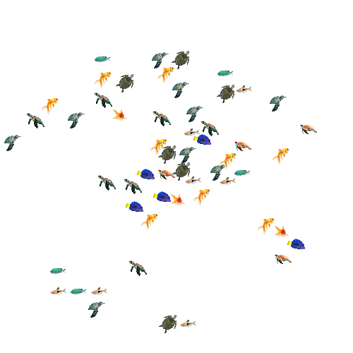
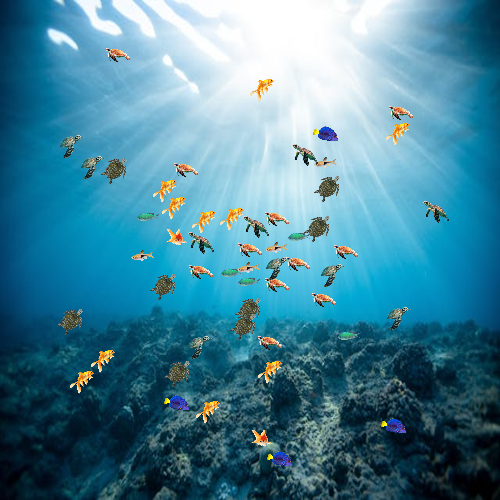
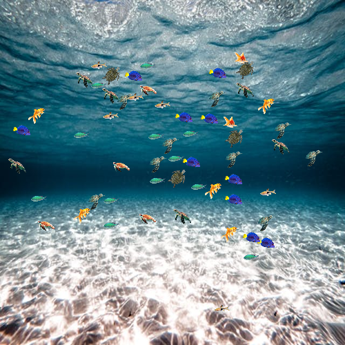
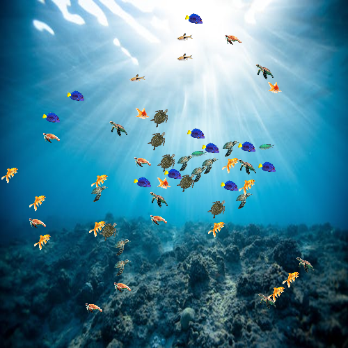
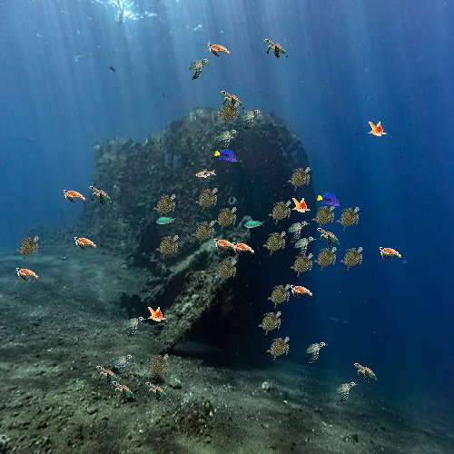
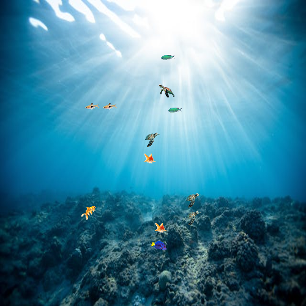
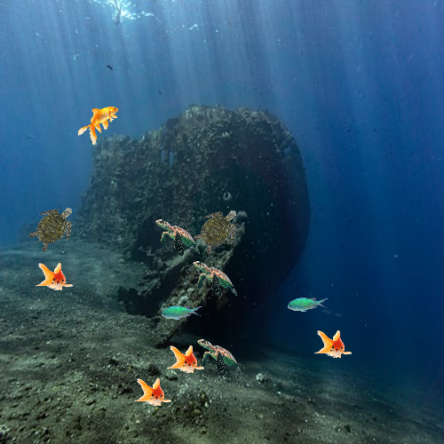
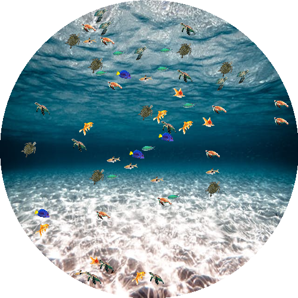
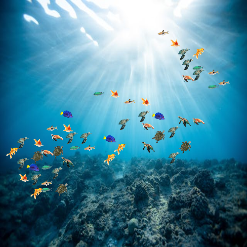

# Scatter YOLO

This is a tool to generate synthetic images where provided images of objects are scattered over a white background or over optionally provided background images.

## Installation

> As this is not yet published in PyPI, manual installation is required.

1. Clone this repository to local
   ```bash
   git clone git@github.com:schapagain/scatter-yolo.git
   ```
2. Create a new virtual environment and install `flit`

   ```bash
   conda create -n scatter-yolo flit
   ```

3. In the root project directory run:
   ```
   flit install
   ```
4. Now you can start using the tool with. To check out all the generation options, run:
   ```
   scatter-yolo generate -h
   ```

## Usage Examples

### Scatter one or more objects

    scatter-yolo generate samples/images/fish samples/images/turtles



### Add backgrounds

    scatter-yolo generate samples/images/fish samples/images/turtles -b samples/images/ocean_bed



### Generate multiple images

    scatter-yolo generate samples/images/fish samples/images/turtles -b samples/images/ocean_bed -c 2

|

### Change object ratios

    scatter-yolo generate samples/images/fish samples/images/turtles -b samples/images/ocean_bed -rat 0.2,0.8



## Change total object count (approx\*)

    scatter-yolo generate samples/images/fish samples/images/turtles -b samples/images/ocean_bed -min 10 -max 20



> \* The exact count of scattered objecs cannot be set, and only min and max counts are accepted. The max parameter is a true maximum, however there might be fewer objects than the min parameters (if there is no space to place enough objects in the image, for example). This is to vary the number of objects in each image when doing bulk generation.

## Change object size

    scatter-yolo generate samples/images/fish samples/images/turtles -b samples/images/ocean_bed -min 10 -max 20 -os 50



## Add circular mask

    scatter-yolo generate samples/images/fish samples/images/turtles -b samples/images/ocean_bed -sh circ



## Reduce spread

    scatter-yolo generate samples/images/fish samples/images/turtles -b samples/images/ocean_bed -cx 0.8



## Generate placement animation

    scatter-yolo generate samples/images/fish samples/images/turtles -b samples/images/ocean_bed -anim yes


